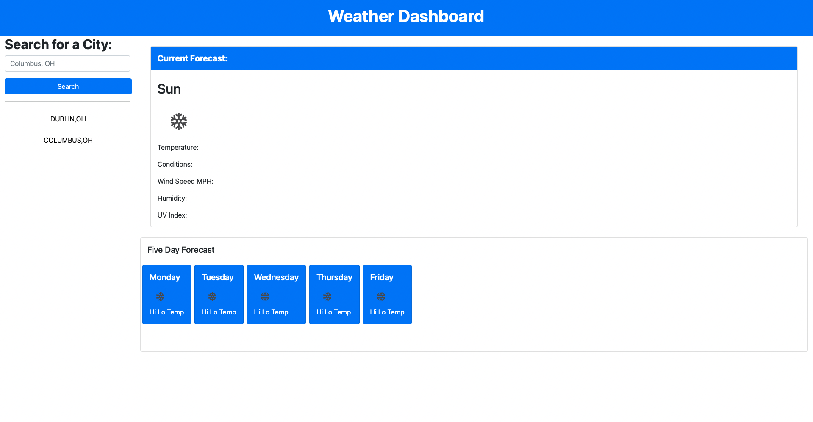

# weatherDashboard-
A weather dashboard that will run in the browser while retrieving data from Open Weather's API. 
Users Story: 
AS A traveler
I WANT to see the weather outlook for multiple cities
SO THAT I can plan a trip accordingly

Link to webpage: https://jaimemarsh.github.io/weatherDashboard-/

Link to github: https://github.com/jaimemarsh/weatherDashboard-

API Key from https://openweathermap.org/

Also used https://www.postman.com